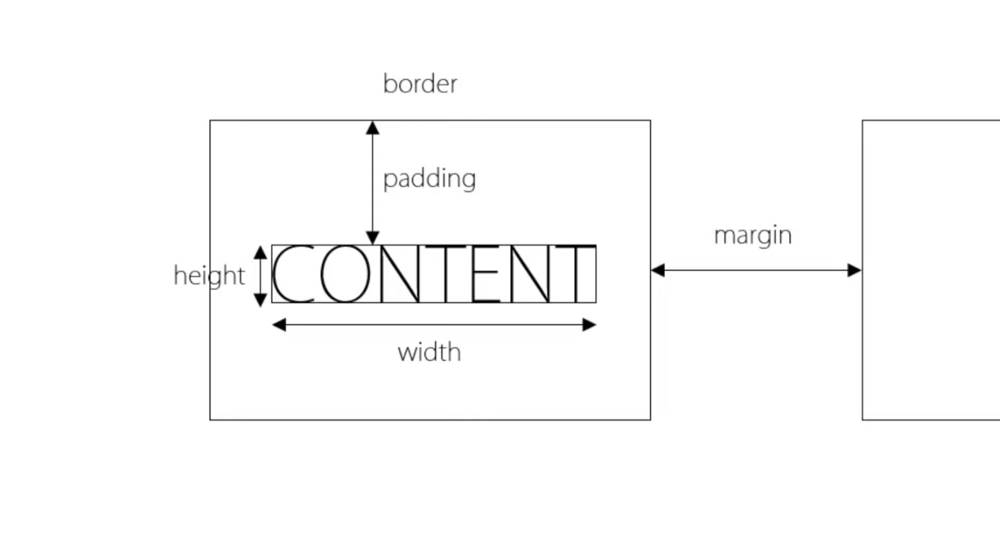

# HTML
Information

- a tag (Link tag)
```html
<!DOCTYPE html>
<html>
<head>
		<meta charset="utf-8" />
</head>
<body>
		안녕하세요. <a href="https://github.com/" target="_blank">github</a> 입니다.
</body>
</html>
```

- list tag
```html
<li> </li>
<ul> </ul>
<ol> </ol>
```

- `index.html` == First Page

# CSS
Cascading Style Sheet

```html
<style> selector {description} </style>
```

- Box Model
